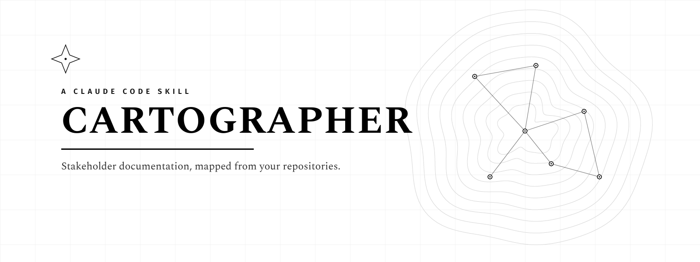

# Cartographer

**Turn the repositories in a project into clear, non-technical stakeholder documentation — without anyone on a dispersed team having to announce what they built.**

Cartographer is a **Claude Code skill** (packaged here also as an installable **plugin**). It scans a project's repositories, reads what each one actually does for users, and writes audience-appropriate documents — Markdown + polished black-and-white PDF — describing *what exists and why it matters*, never how it's built. It's read-only, audience-aware, and records where every fact came from.

---

## What it does

```
/assess   →   review & confirm the product map   →   /generate
```

- **`/assess`** — a read-only pass: discovers and classifies every repo, proposes a *product map* (which repos roll up into which product doc), reports maturity and drift, flags anything new/thin/ambiguous, and **stops for your confirmation**. It never writes stakeholder docs on its own.
- **`/generate [scope] [audience] [lang]`** — writes/refreshes the docs from the confirmed map (defaults: all products, `marketing` audience, your configured language). `audience` is `marketing` (comms / external) or `management` (leadership status).
- **`/doc-status`** — a read-only staleness check: what changed since last documented, and any repo not yet covered.

It produces an **ecosystem overview** (what the products are and how they fit), **one document per product** (what it does, who it's for, how it connects), and an **actions-first assessment** of project status — all in Markdown and PDF, in your configured language(s). Full details, output layout, and design principles are in the skill's own README: **[`skills/cartographer/README.md`](skills/cartographer/README.md)**.

---

## Install

Pick whichever fits. This repo is both the **skill** (at `skills/cartographer/`) and a **plugin marketplace** that serves it.

### 1. As a plugin, via the marketplace — recommended

One command installs the skill *and* the slash commands, and keeps them updatable:

```
/plugin marketplace add nunoamorim99/cartographer
/plugin install cartographer@nunoamorim99
```

The commands appear in the `/` menu namespaced under the plugin — `/cartographer:assess`, `/cartographer:generate`, `/cartographer:doc-status` — and the skill also activates on its own when you ask for stakeholder docs. Update later with `/plugin marketplace update`.

### 2. As a skill only — manual

Copy the skill folder into your skills directory (project-level `.claude/skills/`, or `~/.claude/skills/` for all projects):

```bash
cp -r skills/cartographer ~/.claude/skills/
```

Then just describe what you want ("assess the project", "generate the stakeholder docs") — the skill activates on its own. No commands required.

### 3. Add the slash commands — optional

To get `/assess`, `/generate`, `/doc-status` in the `/` menu without the plugin, drop the command files in too:

```bash
mkdir -p .claude/commands && cp commands/*.md .claude/commands/
```

---

## Requirements

Claude Code. PDF generation needs the Python packages `markdown` and `weasyprint`; the skill installs them into a private virtual environment automatically the first time. (WeasyPrint also needs system libraries — Pango, Cairo, GDK-PixBuf; if they're absent the skill still delivers the Markdown and tells you what to install.)

## Repository layout

```
.
├── .claude-plugin/
│   ├── plugin.json          # plugin manifest (this repo is the plugin)
│   └── marketplace.json     # marketplace catalog (source: ".")
├── skills/
│   └── cartographer/        # THE SKILL — self-contained, bundled fonts
├── commands/                # assess.md, generate.md, doc-status.md
├── assets/cover.png         # cover for this landing page
└── README.md
```

Single source of truth: the skill lives once, at `skills/cartographer/`. The plugin is this repository, so the top-level `skills/` and `commands/` folders *are* the plugin's components — nothing is duplicated.

## Before you publish

- Create the GitHub repo at `github.com/nunoamorim99/cartographer` and push these files. Make sure the hidden `.claude-plugin/` folder is included — the plugin and marketplace depend on it.
- Drop your cover image into **`assets/cover.png`** (this landing page). If you want it inside the packaged skill too, replace `skills/cartographer/docs/assets/cover.png` — same filename, and both READMEs pick it up.
- Optional: confirm the `license` (currently MIT) and add a `LICENSE` file if you want one.
- Verify on your machine: `/plugin marketplace add nunoamorim99/cartographer` then `/plugin install cartographer@nunoamorim99`.

## Credits

Fonts bundled with the skill: **Spectral** (© Production Type) and **Fira Sans** (© The Mozilla Foundation & Telefónica), both under the SIL Open Font License 1.1.
